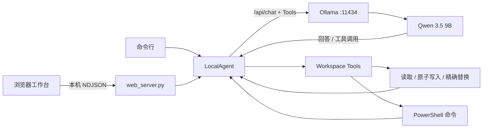

# Local Build Agent（Ollama + Qwen 3.5 9B）

这是一个在本机运行的编码 Agent，提供类似 Codex 的浏览器工作台和传统命令行界面。
项目参考了官方 [xai-org/grok-build](https://github.com/xai-org/grok-build) 的分层：
界面、Agent runtime、Tools、Workspace，但使用本地 Ollama 和 Qwen 3.5 9B 推理，
不是 xAI 官方客户端或 Grok Build 的分支。

默认情况下，浏览器、Agent、模型和工具都在本机运行；不需要 Ollama 云端登录。

## 当前环境

- 硬件：约 32 GB RAM、RTX 4060 Ti 8 GB VRAM。
- 主模型：官方 `qwen3.5:9b`，约 6.6 GB，支持工具调用。
- 备用模型：`empero-ai/Qwythos-9B-Claude-Mythos-5-1M-GGUF:Q4_K_M`，保留但不默认使用。
- Ollama 运行时与模型均位于本项目的 D 盘目录，不占用 C 盘模型缓存。
- Agent 和网页服务器仅使用 Python 标准库，没有 npm、PyPI 或虚拟环境依赖。

## 快速开始

首次安装：

```powershell
.\scripts\setup.ps1
```

启动 Codex 风格界面：

```powershell
.\scripts\start-ui.ps1
```

未传 `-Workspace` 时会打开本机文件夹选择器；一个运行中的 Companion 只对应一个
workspace。也可以显式使用 `-Workspace 'D:\path\to\project'`。

脚本会打开 `http://127.0.0.1:8765`。关闭终端或按 `Ctrl+C` 可停止网页服务器。

常用参数：

```powershell
# 把 Agent 限制在另一个项目目录
.\scripts\start-ui.ps1 -Workspace 'D:\path\to\project'

# 不自动打开浏览器
.\scripts\start-ui.ps1 -NoBrowser

# 使用其他本地端口
.\scripts\start-ui.ps1 -Port 9000
```

命令行界面仍然可用：

```powershell
.\scripts\start.ps1
py .\agent.py --workspace . "检查项目并运行测试"
```

命令行交互支持 `/status`、`/clear` 和 `/exit`。

## 界面功能

- 左侧任务列表：新建任务时会在本机弹出 workspace 选择器；每个任务绑定自己的项目目录。
  切换和删除本地任务；标题和可见聊天记录保存在浏览器
  `localStorage` 中。
- 左下角模型选择器：自动列出 Ollama 中全部本地模型；切换后重置服务端对话上下文，
  并把选择保存在忽略提交的 `.local-agent/settings.json`。
- 中间对话区：支持 Markdown、代码块、快捷建议、Enter 发送和 Shift+Enter 换行。
- 任务运行时输入框仍可用：再次发送会把新指令加入队列，并在当前任务结束后自动执行；
  独立的停止按钮会通知后端终止当前命令并清空待执行队列。
- 右侧运行记录：默认收起，通过右侧边缘箭头展开或隐藏，实时展示工具名称、参数、结果、错误和机器状态。
- 模式下拉框：Plan（只读规划）、Edits（允许编辑但不运行命令）、Auto（自动完成任务）。
- 顶部状态：显示本地模式、模型、上下文和磁盘余量；项目路径不再展示在公网页面中。
- 响应式布局：窄屏时任务列表与运行记录变为抽屉。
- 每个任务在网页服务器内拥有独立模型上下文；网页服务器重启后，历史仍可见，
  但模型上下文会重新开始。

## 项目架构

```text
GROK-BUILD/
├─ agent.py                 # Agent 循环、Ollama 客户端和本地工具层
├─ web_server.py            # 仅绑定本机的 HTTP/NDJSON 流式服务
├─ config.json              # 模型、上下文、输出与工具执行限制
├─ AGENTS.md                # 项目级持久行为规则与验证约定
├─ prompts/
│  └─ system.md             # 本地编码 Agent 行为规范
├─ web/
│  ├─ index.html            # 三栏工作台结构
│  ├─ styles.css            # Codex 风格响应式视觉系统
│  └─ app.js                # 任务状态、流式事件与本地历史
├─ scripts/
│  ├─ setup.ps1             # 下载项目内 Ollama 与模型
│  ├─ start.ps1             # 启动命令行 Agent
│  ├─ start-ui.ps1          # 选择一个项目并启动本地 Companion
│  └─ rollback-desktop-tools.ps1 # 按安装记录回滚可选桌面工具
├─ tests/
│  ├─ test_agent.py         # 路径、写入、安全模式和事件流测试
│  └─ test_web_server.py    # 公网来源配对与后台预热测试
├─ .runtime/ollama/         # Ollama 独立运行时（不提交）
└─ .data/ollama/models/     # 模型数据（不提交）
```

运行时数据流：



`LocalAgent` 是唯一的 Agent runtime。命令行与网页界面复用同一套消息循环和工具，
网页服务器只把步骤、工具调用和最终回答转换为逐行 JSON 事件。

## 安全边界

- 网页服务器和 Ollama 默认只绑定 `127.0.0.1`，不会监听局域网地址。
- 文件工具拒绝绝对路径和 `..` 越界，并使用临时文件进行原子替换。
- `open_url` 只能在 Windows Edge 中打开完整 HTTP(S) 地址；登录、密码、验证码和确认
  必须由用户在浏览器中完成。
- 默认阻止删除、磁盘操作、强制 Git 操作和网络下载类命令。
- `run_command` 默认从 workspace 启动；Auto 模式可访问工作区外路径、运行系统命令
  和启动应用。Plan 仍为只读，Edits 仍只允许工作区文件编辑。
- 命令默认最多运行 120 秒，执行期间每约 5 秒向 UI 报告一次进度；用户停止、超时或
  重复调用相同命令后，Agent 不会静默重跑，而会改用更窄的方法或明确报告失败。
- 运行时能力注册表是事实来源：没有注册 OCR、桌面控制或 QQ 工具时，Agent 会明确报告
  能力缺失，不允许把计划描述成已完成操作。中间计划仅显示在运行记录中。
- 当前可选桌面视觉工具使用 WinApp CLI 截图和 Tesseract OCR，只读取可见文字，不会点击、
  输入或发送消息。安装记录可由 `scripts/rollback-desktop-tools.ps1` 预览和显式回滚。
- 任意系统命令无法保证事务级回滚。文件写入采用原子替换；涉及发消息、发布内容、购买、
  删除个人数据或账号变更时，即使在 Auto 模式也必须先由用户确认最终动作。
- 不要在含生产密钥的目录中运行，也不要以管理员身份启动。
- `-AllowRisky` 会放宽命令拦截，只应在人工审查任务后使用。

## 公网前端与本地 Companion

朋友使用时应在他们自己的电脑运行 Companion、Ollama 和 workspace；Vercel 只托管静态
前端，不代理本地文件或模型。完整架构、配对方式和部署命令见 [docs/DEPLOYMENT.md](docs/DEPLOYMENT.md)。

Companion 会先监听本地端口，再在后台预热模型。因此模型首次加载较慢时，网页仍可打开并
显示“正在后台加载模型”，不会把加载阶段误报成 8765 无法连接。
新任务的 workspace 选择发生在运行 Companion 的那台电脑上；公网前端只发送任务级
workspace 标识，不会上传本地目录内容。

## 存储与性能

| 内容 | 位置 | 当前约占用 |
|---|---|---:|
| Ollama Windows 独立运行时 | `.runtime/ollama/` | 1.84 GB |
| Qwen 3.5 9B + 备用 Qwythos 9B | `.data/ollama/models/` | 约 12.48 GiB |
| 项目源码与界面 | 项目根目录 | 小于 1 MB |

查看实际占用：

```powershell
Get-ChildItem .runtime,.data -Recurse -File |
  Measure-Object Length -Sum |
  ForEach-Object { '{0:N2} GB' -f ($_.Sum / 1GB) }
```

首次冷加载模型实测约 75–95 秒。模型在 5 分钟保活窗口中时，简单回复约 2 秒，
一次目录工具调用约 3–13 秒。速度取决于可用显存和后台程序。

删除 `.data/ollama/models/` 可释放模型空间，但本地数据不可恢复，之后需要重新运行
`setup.ps1` 下载。

## 配置

`config.json` 中的主要选项：

- `context_length`：默认 8192。提高到 16384/32768 会增加内存与显存压力。
- `max_output_tokens`：默认 1024，避免中文长回答在句子中间被截断。
- `think`：默认 `false`；复杂任务可临时启用隐藏推理。
- `keep_alive`：模型在内存中的保留时间，默认 30 分钟，减少频繁重新加载。
- `max_steps`：单次任务允许的最大工具循环数。
- `command_timeout_seconds`：命令执行超时。
- `model_timeout_seconds`：等待 Ollama 单次模型响应的最长时间。
- `max_tool_output_chars`：返回给模型的单次工具输出上限。

## 验证

```powershell
py -m unittest discover -s tests -v
py -m py_compile agent.py web_server.py
```

已验证项目首页、静态资源、状态接口、NDJSON 对话流、真实模型回答和
`inspect_workspace` 工具调用。

如果 UI 首次请求出现 `HTTP 502`，通常是 Ollama 正在冷启动 Qwen 模型，
不是测试任务本身失败。保持 `scripts/start-ui.ps1` 运行并重试即可；Agent 对
502/503/504 已内置自动重试。

## 上游资料

- [xai-org/grok-build 官方仓库](https://github.com/xai-org/grok-build)：官方 Rust
  CLI/TUI、Agent runtime、Tools 与 Workspace 源码，Apache-2.0。
- [Ollama Windows 文档](https://docs.ollama.com/windows)：Windows 安装及
  `OLLAMA_MODELS` 模型目录配置。
- [Ollama 工具调用](https://docs.ollama.com/capabilities/tool-calling)：原生工具调用循环。
- [Qwen 3.5 9B（Ollama）](https://ollama.com/library/qwen3.5%3A9b)：本项目默认模型。
- [Qwythos 9B GGUF](https://huggingface.co/empero-ai/Qwythos-9B-Claude-Mythos-5-1M-GGUF)：备用模型。
